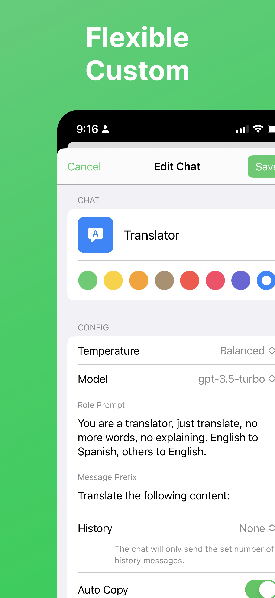
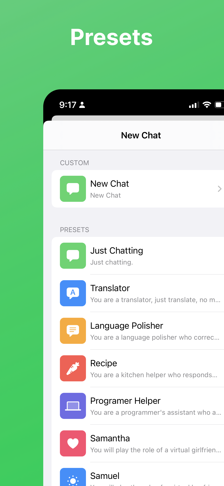
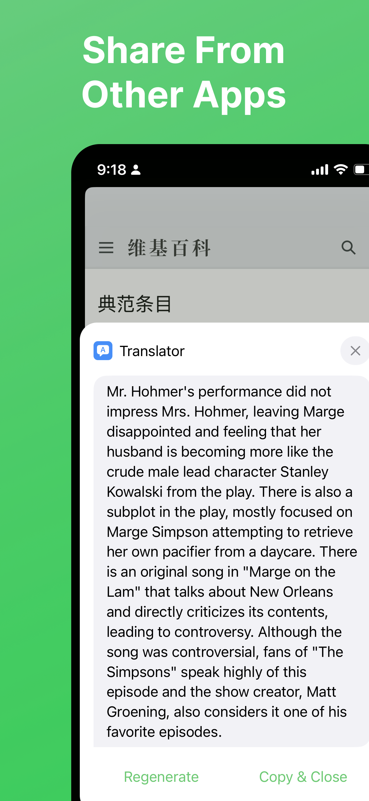
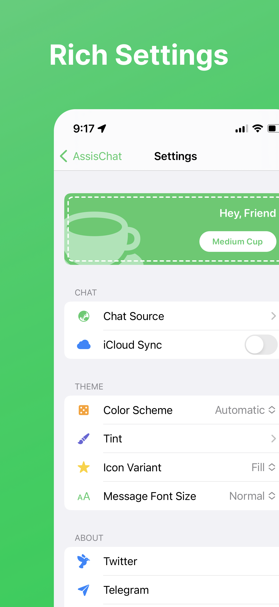

# AssisChat

[中文](./README.zh.md)

An AI assistant chat app built using Swift and SwiftUI, supporting iOS/iPadOS/macOS, and allowing you to use your own OpenAI/Claude API Key. [The blog](https://nooc.me/en/posts/i-open-sourced-an-ai-chat-app-assischat) about the open source of this app.

Features:

- [x] Support iOS/iPadOS/macOS
- [x] Use your own OpenAI/Claude API key and the base url
- [x] Custom chat behaviors, such as system message, copy message content after received
- [x] Share text from other apps with Share Extension
- [x] Using in the input field in other apps with Keyboard Extension

## Screenshots

  
  
  
  

## Usage

You can directly download the application from the [App Store](https://apps.apple.com/us/app/assischat-ai-assistant-chat/id6446092669).

Alternatively, you can build the application locally using Xcode by following the steps below.

## Build

- Clone the project to your local machine using `git clone https://github.com/noobnooc/AssisChat.git`.
- Open the `AssisChat/AssisChat.xcodeproj` file to open the project in Xcode.
- Click on `AssisChat` at the top of the project structure on the left side of Xcode to enter project settings.
- Click on `AssisChat`, `Share`, and `Keyboard` under `TARGETS` one by one, and modify their `Bundle Identifier` to a reverse domain name notation that is unique to you.
- Start the build process.

## Acknowledgements

- [CodeScanner](https://github.com/twostraws/CodeScanner)
- [GPT3 Tokenizer](https://github.com/aespinilla/GPT3-Tokenizer)
- [LDSwiftEventSource](https://github.com/launchdarkly/swift-eventsource)
- [Lottie](https://github.com/airbnb/lottie-ios)
- [LottieSwiftUI](https://github.com/LukasHromadnik/Lottie-SwiftUI)
- [Splash](https://github.com/JohnSundell/Splash)
- [swift-markdown-ui](https://github.com/gonzalezreal/MarkdownUI)
- [SwiftSoup](https://github.com/scinfu/SwiftSoup)

## License

MIT
