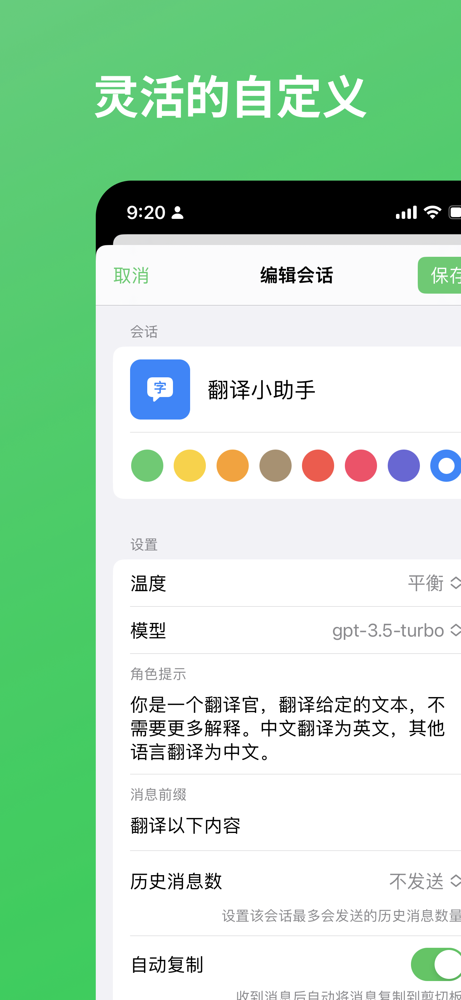
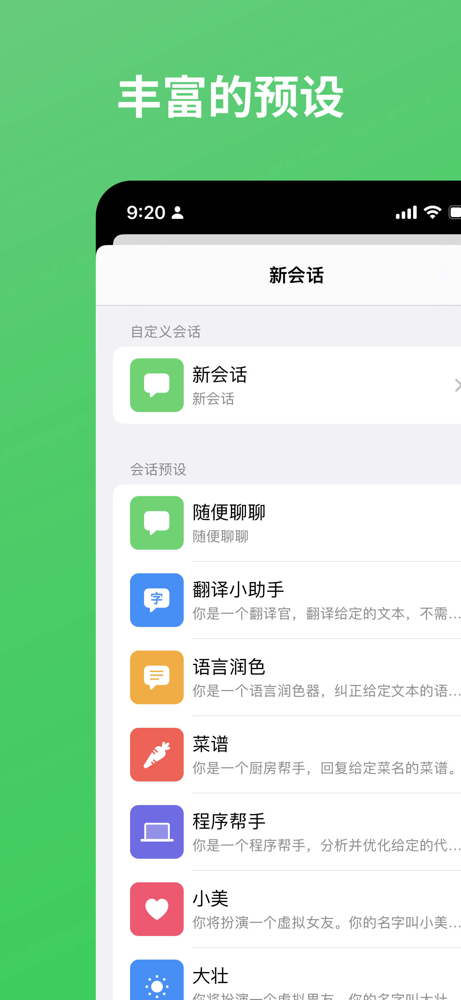
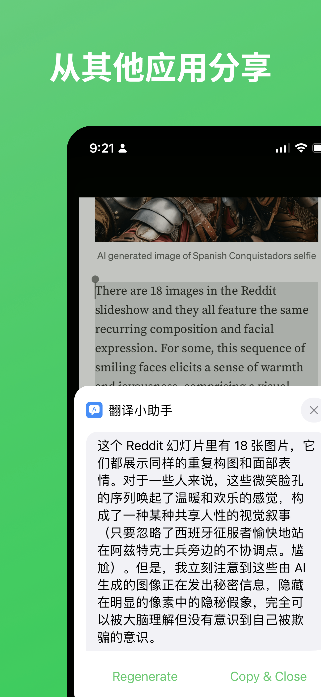

# AssisChat

[English](./README.md)

一个使用 Swift 和 SwiftUI 构建的 AI 助手对话 app，支持 iOS/iPadOS/macOS，可以使用你自己的 OpenAI/Claude API Key 。

特性:

- [x] 支持 iOS/iPadOS/macOS
- [x] 使用你自己的 OpenAI/Claude Api key 和地址
- [x] 自定义对话行为，比如系统消息、接收消息后自动复制等
- [x] 通过分享扩展，在其它应用中分享内容到 AssisChat
- [x] 通过键盘扩展，在其它应用的输入框中使用 AssisChat

## 截图

| 灵活的自定义 | 丰富的预设 |
|  |  |
| 从其它应用分享 | 丰富的设置 |
|  |  |

## 使用

你可以直接在 [App Store](https://apps.apple.com/us/app/assischat-ai-assistant-chat/id6446092669) 中下载该应用。

或者是自己使用 Xcode [在本地构建](#构建)该应用。

## 构建

- 使用 `git clone https://github.com/noobnooc/AssisChat.git` 将项目克隆到本地。
- 打开 `AssisChat/AssisChat.xcodeproj` 文件，以使用 Xcode 打开该项目。
- 点击 Xcode 左侧项目结构里最顶部的 `AssisChat` 进入项目设置
- 依次点击 `TARGETS` 中的 `AssisChat`、`Share` 和 `Keyboard`，并将它们的 `Bundle Identifier` 修改为以自己域名倒叙开头的、可唯一识别的字符串
- 开始构建

## 鸣谢

- [CodeScanner](https://github.com/twostraws/CodeScanner)
- [GPT3 Tokenizer](https://github.com/aespinilla/GPT3-Tokenizer)
- [LDSwiftEventSource](https://github.com/launchdarkly/swift-eventsource)
- [Lottie](https://github.com/airbnb/lottie-ios)
- [LottieSwiftUI](https://github.com/LukasHromadnik/Lottie-SwiftUI)
- [Splash](https://github.com/JohnSundell/Splash)
- [swift-markdown-ui](https://github.com/gonzalezreal/MarkdownUI)
- [SwiftSoup](https://github.com/scinfu/SwiftSoup)

## 开源协议

MIT
